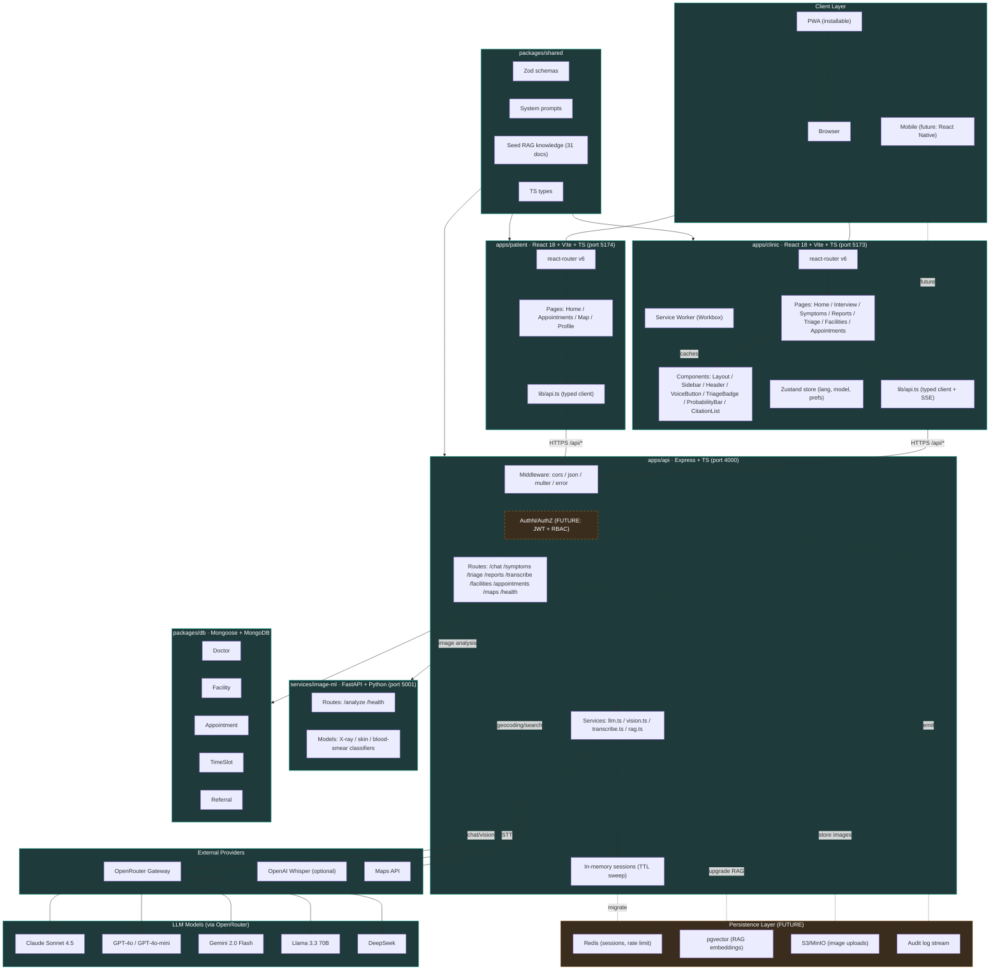

# System Architecture — MedAccess AI v0.1.0



## Layers Explained

### 1. Client (PWA + Browser)
- **Vite dev servers:** `apps/clinic` on `:5173`, `apps/patient` on `:5174`
- **Service Worker** (Workbox) caches shell assets; API calls always hit network
- **Installable on Android/iOS** as standalone app icon
- Falls back gracefully under spotty connectivity (cached pages visible, API calls queue)

### 2. Frontend — Clinic App (apps/clinic, port 5173)
- **React 18** + **react-router v6** for SPA routing
- **Zustand** store persists `language` + `model` prefs to localStorage
- **Tailwind CSS** (dark theme, `ink` + `accent` palette)
- **Pages:** Home (nav cards) + Interview (chat) + Symptoms (ranking) + Reports (vision) + Triage (emergency) + Facilities + Appointments
- **Typed API client** in `lib/api.ts` — every endpoint call is type-safe (Zod inferred)
- **VoiceButton** on free-text inputs — routes to Whisper (if key set) or browser Web Speech API

### 3. Frontend — Patient App (apps/patient, port 5174)
- **React 18** + **react-router v6**
- **Pages:** Home + Appointments + Map (facility finder) + Profile
- Shares Zod schemas and TS types from `packages/shared`

### 4. Shared Package (packages/shared)
- **Single source of truth** for API contracts (Zod schemas)
- **System prompts** for every model call (interview, symptom analysis, vision, triage)
- **Seed RAG knowledge:** 31 curated clinical docs (malaria, dengue, TB, ACS, stroke, IMCI, sepsis, etc.)
- **TS types** inferred from Zod, used by both frontends + API

### 5. Backend API (apps/api, port 4000)
- **Express + TS** (proxied from `:5173/api/*` and `:5174/api/*` in dev)
- **Endpoint families:**
  - `POST /api/chat` + `/api/chat/stream` (SSE) — interview + history
  - `POST /api/symptoms` — symptom → differential ranking
  - `POST /api/triage` — case + vitals → Manchester triage
  - `POST /api/reports/analyze` — multipart image → vision analysis (proxies to image-ml sidecar)
  - `POST /api/transcribe` — multipart audio → Whisper STT (optional)
  - `GET/POST /api/facilities` — facility CRUD + search
  - `GET/POST /api/appointments` — appointment booking + management
  - `GET /api/maps` — geocoding + facility map search
- **Services:**
  - `llm.ts` — OpenRouter client (OpenAI SDK with baseURL swap)
  - `vision.ts` — multimodal image → structured JSON via chat.completions with `response_format: json_object`
  - `transcribe.ts` — OpenAI Whisper STT (or browser Web Speech fallback)
  - `rag.ts` — BM25 keyword retrieval over seed docs
- **Middleware:** cors, json body parser, multer file upload, error handler
- **Sessions:** In-memory `Map<sessionId, { messages[], createdAt, updatedAt }>` with TTL sweep every 5 min

### 6. Image ML Sidecar (services/image-ml, port 5001)
- **FastAPI + Python** — independent process, called over HTTP by `apps/api`
- Routes: `POST /analyze` (image classification), `GET /health`
- Classifiers: X-ray (chest pathology), skin lesion, blood-smear (malaria)
- Interface owned jointly by **Ismail + Temirlan** — do not modify without both signing off

### 7. Database (packages/db — Mongoose + MongoDB)
- **Models:**
  - `Doctor` — profile, specialty, facilityId (String)
  - `Facility` — name, location, type, coordinates
  - `Appointment` — patientId, doctorId (String), facilityId (String), slot, status
  - `TimeSlot` — doctorId (String), facilityId (String), datetime, available
  - `Referral` — referring doctor, referred doctor, patient, reason, status

### 8. External Services
- **OpenRouter** (gateway to 50+ LLM providers)
  - Default: `anthropic/claude-sonnet-4.5` (top on HealthBench 2026)
  - Fast fallbacks: `openai/gpt-4o-mini`, `google/gemini-2.0-flash`
  - One key, zero migration cost (OpenAI SDK compatible)
- **OpenAI Whisper** (optional, server-side STT)
  - Requires separate `OPENAI_API_KEY`
  - Browser Web Speech API fallback (zero-key, works in Chrome/Edge)
- **Maps API** — geocoding + facility search for `/api/maps`

### 9. Persistence (Current: MongoDB; Future additions)
- **MongoDB:** Live — doctors, facilities, appointments, timeslots, referrals
- **Redis:** Future — sessions (replace in-memory), rate limiting, caching
- **pgvector:** Future — embedding-based RAG (when corpus > ~200 docs)
- **S3/MinIO:** Future — image uploads (currently in-memory)

## Data Flow: Symptom Analysis Example

```
1. User inputs symptoms + patient context in /symptoms page
2. Frontend calls lib/api.ts → POST /api/symptoms
3. API validates with SymptomsRequestSchema (Zod)
4. RAG retrieves top 3–4 docs matching symptom keywords (BM25)
5. LLM (OpenRouter) runs system prompt + retrieval results + symptoms → JSON
6. safeParseJson() repairs garbled JSON; best-effort Zod validate
7. Response: { differentials[], urgency, recommendedNextSteps, disclaimer }
8. Frontend renders ProbabilityBar[] (sorted desc), urgency badge, warnings
9. CitationList shows which RAG docs informed the answer
```

## Scaling Plan (Post-MVP)

| Milestone | Trigger | Work |
|---|---|---|
| **Auth v1** | Day after submission | JWT + local clinic auth, no SAML yet |
| **DB v2** | Week 2 | Migrate sessions → Redis; add pgvector |
| **RAG v2** | Week 4 (~200 seed docs ingested) | Add pgvector embeddings, hybrid BM25+semantic |
| **Multi-tenant** | Week 6 | Clinic isolation, per-clinic settings, auth/RBAC |
| **Compliance** | Month 2 | HIPAA/GDPR audit, data retention, encrypted backups |
| **Native (iOS/Android)** | If funding | React Native shares 70%+ code with web |

## Definitions

- **MVP (v0.1.0):** Stateless API, in-memory sessions, no auth, 31-doc RAG, MongoDB for structured data, open to all
- **v0.2.0:** Auth + full Postgres/Redis, multi-clinic RBAC, persistent patient records
- **v1.0.0:** Production-ready: compliance, large corpus RAG, analytics, mobile native
