```mermaid
erDiagram

    %% ── Facility layer ───────────────────────────────────────────────────────
    FACILITY ||--o{ DOCTOR      : "employs"
    FACILITY ||--o{ TIME_SLOT   : "hosts"
    FACILITY ||--o{ APPOINTMENT : "has"

    DOCTOR   ||--o{ TIME_SLOT   : "owns"
    DOCTOR   ||--o{ APPOINTMENT : "receives"

    TIME_SLOT ||--o| APPOINTMENT : "locked_by"

    %% ── Patient layer ────────────────────────────────────────────────────────
    PATIENT  ||--o{ APPOINTMENT : "books"
    PATIENT  }o--o| FACILITY    : "home_facility (opt)"
    PATIENT  }o--o| DOCTOR      : "primary_doctor (opt)"

    %% ── Clinical encounter layer (MA Agent → Doctor handoff) ─────────────────
    APPOINTMENT ||--o| ENCOUNTER    : "triggers"
    ENCOUNTER   ||--o{ INTERVIEW    : "contains"
    ENCOUNTER   ||--o{ SYMPTOM_ANALYSIS : "contains"
    ENCOUNTER   ||--o{ TRIAGE_RESULT    : "contains"
    ENCOUNTER   ||--o{ REPORT_ANALYSIS  : "contains"
    ENCOUNTER   ||--o{ VITALS           : "records"

    INTERVIEW    ||--o{ MESSAGE    : "has"
    MESSAGE      }o--o{ CITATION   : "references"
    CITATION     }|--|| RAG_DOC    : "cites"

    REPORT_ANALYSIS ||--|| IMAGE_UPLOAD    : "from"
    REPORT_ANALYSIS ||--o{ VISION_FINDING  : "produces"
    SYMPTOM_ANALYSIS ||--o{ DIFFERENTIAL   : "ranks"

    %% ── Auth layer (v0.2) ────────────────────────────────────────────────────
    USER    }o--|| ROLE       : "has"
    ROLE    ||--o{ PERMISSION : "grants"
    USER    ||--o{ SESSION    : "creates"
    USER    ||--o{ AUDIT_LOG  : "generates"

    %% ── Entities ─────────────────────────────────────────────────────────────

    FACILITY {
        ObjectId id          PK
        string   name
        string   type        "hospital | clinic | pharmacy"
        string   address
        string   city
        string   country
        float    lat
        float    lng
        string   phone
        string   email
        string   website
        json     openingHours "day / open / close"
        string[] specialties
        string   source      "manual | osm | google | naver"
        string   sourceId    "external place ID"
        boolean  verified
        boolean  active
        Date     createdAt
        Date     updatedAt
    }

    DOCTOR {
        ObjectId      id                  PK
        ObjectId      facilityId          FK
        string        name
        string        specialty           "from MEDICAL_SPECIALTIES"
        string        licenseNo
        string        phone
        string        email
        string        bio
        string[]      languages
        int           consultationMinutes "default 30"
        boolean       active
        Date          createdAt
        Date          updatedAt
    }

    TIME_SLOT {
        ObjectId id            PK
        ObjectId doctorId      FK
        ObjectId facilityId    FK
        string   date          "YYYY-MM-DD"
        string   startTime     "HH:MM"
        string   endTime       "HH:MM"
        boolean  isBooked      "false → available"
        ObjectId appointmentId FK "null until booked"
        Date     createdAt
        Date     updatedAt
    }

    APPOINTMENT {
        ObjectId id             PK
        string   patientName
        string   patientPhone
        string   patientEmail
        int      patientAge
        string   patientSex     "male | female | other"
        ObjectId slotId         FK
        ObjectId doctorId       FK
        ObjectId facilityId     FK
        string   specialty
        string   urgency
        text     maAgentSummary "AI-generated report ≤4000 chars"
        string   sessionId
        string   status         "pending | confirmed | cancelled | completed"
        text     doctorNotes    "written during/after encounter"
        Date     confirmedAt
        Date     completedAt
        Date     createdAt
        Date     updatedAt
    }

    PATIENT {
        ObjectId id                  PK
        string   fullName
        Date     dateOfBirth
        string   sex                 "male | female | other | unknown"
        string   bloodType           "A+ | A- | B+ | B- | AB+ | AB- | O+ | O-"
        string   nationalId
        string   phone
        string   email
        string   address
        string   city
        string   country
        string   preferredLanguage
        string   insuranceProvider
        string   insuranceNumber
        json     emergencyContact    "name / phone / relationship"
        string[] knownAllergies
        string[] chronicConditions
        string[] currentMedications
        ObjectId homeFacilityId      FK "optional"
        ObjectId primaryDoctorId     FK "optional"
        string   sessionId
        boolean  active
        Date     createdAt
        Date     updatedAt
    }

    ENCOUNTER {
        ObjectId id           PK
        ObjectId appointmentId FK
        ObjectId patientId     FK
        ObjectId doctorId      FK
        string   status       "open | signed | closed"
        Date     startedAt
        Date     closedAt
    }

    INTERVIEW {
        ObjectId id          PK
        ObjectId encounterId FK
        string   sessionId
        string   language
        string   model
    }

    MESSAGE {
        ObjectId id          PK
        ObjectId interviewId FK
        string   role        "user | assistant"
        text     content
        Date     createdAt
    }

    SYMPTOM_ANALYSIS {
        ObjectId id          PK
        ObjectId encounterId FK
        string   urgency
        string   model
        Date     createdAt
    }

    DIFFERENTIAL {
        ObjectId id          PK
        ObjectId analysisId  FK
        string   condition
        string   likelihood
        float    probabilityPct
        text     reasoning
    }

    TRIAGE_RESULT {
        ObjectId id          PK
        ObjectId encounterId FK
        string   level       "RED | ORANGE | YELLOW | GREEN | BLUE"
        string   targetTimeToCare
        text     rationale
    }

    REPORT_ANALYSIS {
        ObjectId id          PK
        ObjectId encounterId FK
        ObjectId imageId     FK
        string   imageType
        text     qualityNotes
        string   model
    }

    VISION_FINDING {
        ObjectId id       PK
        ObjectId reportId FK
        string   label
        float    confidence
        string   notes
    }

    IMAGE_UPLOAD {
        ObjectId id        PK
        string   url
        string   mimeType
        int      sizeBytes
        Date     uploadedAt
    }

    VITALS {
        ObjectId id          PK
        ObjectId encounterId FK
        int      hrBpm
        int      sbpMmHg
        int      spo2Pct
        float    tempC
    }

    USER {
        ObjectId id           PK
        string   email        UK
        string   passwordHash
        ObjectId roleId       FK
        ObjectId facilityId   FK
        string   locale
        Date     createdAt
        Date     lastLoginAt
    }

    ROLE {
        ObjectId id          PK
        string   name        "doctor | pharmacist | admin"
        string   description
    }

    PERMISSION {
        ObjectId id       PK
        string   resource
        string   action   "read | write | delete | sign"
    }

    SESSION {
        ObjectId id        PK
        ObjectId userId    FK
        string   token
        Date     expiresAt
    }

    AUDIT_LOG {
        ObjectId id       PK
        ObjectId userId   FK
        string   action
        string   resource
        json     metadata
        Date     createdAt
    }

    RAG_DOC {
        ObjectId id        PK
        string   title
        text     content
        json     tags
        Date     indexedAt
    }

    CITATION {
        ObjectId id        PK
        ObjectId messageId FK
        ObjectId ragDocId  FK
        float    score
    }
```

# ER Model — MedAccess AI

> **Status (v0.1):** Core models implemented and exported from `@medaccess/db`.
> Facility / Doctor / TimeSlot / Appointment in production seed mode (in-memory fallback, DB-ready).
> Full auth + multi-tenant RBAC deferred to v0.2.

---

---

## Key Design Decisions

1. **Facility-centric:** All clinical activity anchors to `FACILITY`. Hospitals, clinics, and pharmacies are all `FACILITY` records with `type` discriminator. Doctors/pharmacists are `DOCTOR` records with `facilityId` FK.

2. **Specialty as enum:** `DOCTOR.specialty` is constrained to `MEDICAL_SPECIALTIES` (30 values in `packages/shared/src/types.ts`). Single source of truth — same list used in Login dropdown, FindCare filter chips, and MA Agent referral matching.

3. **Slot-based booking:** `TIME_SLOT` owns availability. `isBooked=false` → slot available. On booking: `isBooked` set to `true`, `appointmentId` back-linked. Prevents double-booking at the DB level.

4. **Patient demographics at booking (v0.1):** No auth in v0.1. `APPOINTMENT` captures full patient demographics inline. `PATIENT` model exists for registered repeat patients (linked via `sessionId`).

5. **MA Agent → Doctor handoff:** `APPOINTMENT.maAgentSummary` carries the AI-generated report (≤4000 chars). Doctor sees this in the clinic portal before the encounter, saving consultation time.

6. **Encounter-centric clinical record:** All clinical analysis (interview transcript, symptom differentials, triage level, vision findings) ties to `ENCOUNTER`, never to `APPOINTMENT` alone. One appointment → one encounter.

7. **Pharmacy model:** Pharmacy = `FACILITY` with `type='pharmacy'`. Pharmacists are `DOCTOR` records with `specialty='Pharmacy'` at that facility. Prescription requests routed to the pharmacy's pharmacist staff.

8. **Facility data source:** `FACILITY.source` tracks provenance (`osm | google | naver | manual | registered`). Demo data is **9 real Seoul facilities with real coordinates + fictional demo doctors**, registered via the public API by `scripts/seed-demo.mjs` (Korea-first market; no Uzbekistan seed). `db:clean` wipes it; re-seed to restore.

9. **Geo-ready:** `FACILITY` has `lat`/`lng` indexed. Future: add `{ type: 'Point', coordinates: [lng, lat] }` GeoJSON field for MongoDB `$geoNear` queries.

10. **Auth deferred to v0.2:** `USER`, `ROLE`, `PERMISSION`, `SESSION` modelled but not enforced. v0.2 adds `requireAuth()` middleware and JWT sessions.

---

## API Endpoints (v0.2)

| Method | Path | Description |
|--------|------|-------------|
| `GET`  | `/api/facilities` | Search facilities by lat/lng/specialty/type/city |
| `GET`  | `/api/facilities/:id` | Single facility + doctor list |
| `GET`  | `/api/facilities/:id/doctors` | Doctors at facility |
| `GET`  | `/api/facilities/:id/slots?doctorId&date` | Available time slots |
| `POST` | `/api/appointments` | Book a slot |
| `GET`  | `/api/appointments` | Clinic portal queue (filter by status/doctor) |
| `PATCH`| `/api/appointments/:id` | Confirm / cancel / complete |

Legacy (kept for backward compat):

| Method | Path | Description |
|--------|------|-------------|
| `GET`  | `/api/clinics` | Old offset-based clinic list |
| `POST` | `/api/clinics/referrals` | Old referral booking |
| `GET`  | `/api/clinics/referrals` | Old referral queue |
| `PATCH`| `/api/clinics/referrals/:id` | Old status update |

---

## Migration Path

1. Seed `FACILITY` + `DOCTOR` documents from OSM Overpass API (Uzbekistan).
2. Generate `TIME_SLOT` records for next 30 days on server startup (cron job).
3. Migrate old in-memory `Referral` entries to `APPOINTMENT` model.
4. Add `2dsphere` GeoJSON index to `FACILITY` for proper `$geoNear`.
5. v0.2: Add `USER` auth, replace `localStorage` role store with JWT + `USER.roleId`.
