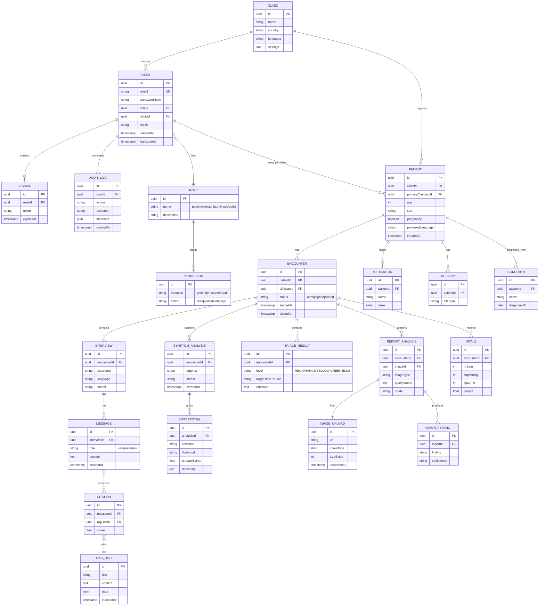

# ER Model — MedAccess AI (Post-MVP)

> **Note:** Current MVP (v0.1.0) has NO database. This ER model is for the **planned production architecture** after submission. See [TODO.md](../TODO.md#9--deferred-post-competition) for the roadmap.

## Key Design Decisions

1. **Multi-tenant:** `clinicId` on `USER`, `PATIENT`, `ENCOUNTER` ensures clinic isolation.
2. **RBAC:** `ROLE` + `PERMISSION` for granular access (clinician ≠ admin ≠ patient).
3. **Encounter-centric:** All analysis (interview, symptoms, triage, reports) tie to an `ENCOUNTER`, never to a patient alone.
4. **Audit trail:** Every user action logged in `AUDIT_LOG` for compliance (HIPAA, GDPR).
5. **Soft deletes:** Add `deletedAt` timestamp to all tables for data retention.
6. **RAG upgrade:** When corpus grows past ~200 docs, add `RAG_EMBEDDING` table with pgvector embeddings.

## Migration Path from MVP

1. Create `CLINIC` seed record.
2. Backfill `USER` from auth signup log (currently none).
3. Add `clinicId` to all session-based requests.
4. Migrate in-memory sessions → Redis (no schema change).
5. Add auth middleware: `requireUser()`, `requireRole('clinician')`.
